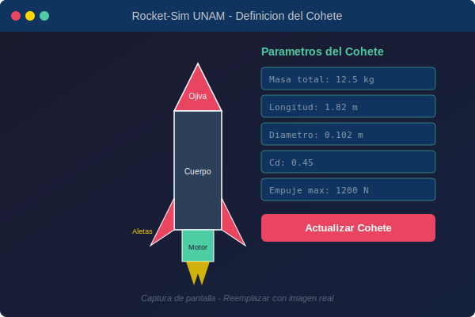
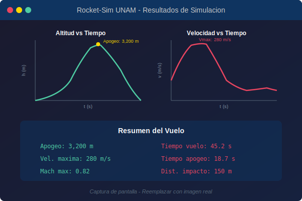
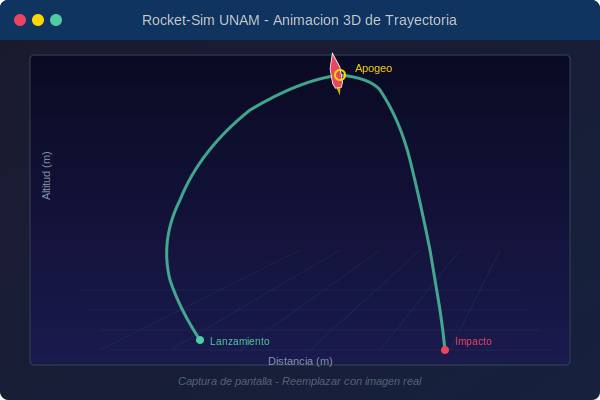

# Rocket-Sim UNAM: Simulador de Vuelo de Cohetes 3-DOF


<p align="center">
  
</p>

**Rocket-Sim UNAM** es un simulador numérico avanzado para la dinámica de vuelo de cohetes suborbitales, con un motor de **3 Grados de Libertad (3-DOF)** y una interfaz gráfica moderna. Este proyecto nació como parte de la tesis de licenciatura en Matemáticas de Natalia Edith Mejia Bautista y fue desarrollado en colaboración con el equipo **Propulsión UNAM** de la Facultad de Ingeniería de la UNAM.

---

## Tabla de Contenidos

- [Descripción General](#descripción-general)
- [Características Principales](#características-principales)
- [Capturas de Pantalla](#capturas-de-pantalla)
- [Instalación y Ejecución](#instalación-y-ejecución)
- [Uso Básico](#uso-básico)
- [Arquitectura Técnica](#arquitectura-técnica)
- [Estructura del Proyecto](#estructura-del-proyecto)
- [Métodos Numéricos Disponibles](#métodos-numéricos-disponibles)
- [Validación](#validación)
- [Casos de Estudio Simples](#casos-de-estudio-simples)
- [Créditos y Autoría](#créditos-y-autoría)
- [Cómo Contribuir](#cómo-contribuir)
- [Licencia](#licencia)
- [Roadmap](#roadmap)

---

## Descripción General

El objetivo principal de este simulador es proporcionar una herramienta robusta y de código abierto para el **diseño, análisis y validación de trayectorias de cohetes experimentales**. Está diseñado para ser utilizado por equipos estudiantiles de cohetería, investigadores y como recurso educativo en cursos de ingeniería aeroespacial y dinámica de vuelo.

Este software traduce los complejos modelos matemáticos de la mecánica de vuelo a una plataforma interactiva y accesible, permitiendo a los usuarios:

- **Evaluar la estabilidad** de un diseño antes de su manufactura.
- **Predecir con precisión** el apogeo, la zona de impacto y otros parámetros críticos del vuelo.
- **Optimizar el rendimiento** del vehículo a través de la simulación de múltiples escenarios.
- **Incrementar la seguridad** en los lanzamientos experimentales.

El desarrollo y la validación de este simulador constituyen el núcleo de la tesis de licenciatura **"Simulación Numérica de la Dinámica de un Cohete Híbrido"**.

> **[Consulta la tesis completa aquí (PDF)](./Tesis_UNAM_NataliaMejBau_COMPLETAFINAL.pdf)**

---

## Características Principales

| Característica | Descripción |
|---|---|
| **Motor de Simulación 3-DOF** | Modela traslación (x, y, z) y rotación pitch del cohete como cuerpo rígido |
| **Interfaz Gráfica Intuitiva** | Desarrollada con `CustomTkinter`, permite definir todos los aspectos del cohete y la simulación sin necesidad de escribir código |
| **Definición Modular de Cohetes** | Construye un cohete a partir de componentes detallados: ojiva, cuerpo, aletas, motor, tanques, sistemas internos, etc. |
| **Métodos Numéricos Avanzados** | Suite de integradores de EDOs de alto orden con control de paso adaptativo (DOP853, RK45, BDF, LSODA, entre otros) |
| **Análisis de Estabilidad Estática** | Cálculo automático y en tiempo real del Centro de Gravedad (CG), Centro de Presión (CP) y margen estático |
| **Modelo Atmosférico Completo** | Modelo ISA de 8 capas que cubre desde la tropósfera hasta la mesopausa (0–84,852 m) |
| **Modelado de Viento** | Viento 3D con modelos de ráfaga estocásticos: escalón, rampa lineal y coseno |
| **Visualización Completa** | Gráficas detalladas y animaciones 3D de trayectoria, orientación, velocidades y fuerzas aerodinámicas |
| **Importación de Datos** | Carga de curvas de empuje y coeficientes de arrastre desde archivos CSV |
| **Mapa Interactivo** | Visualización del sitio de lanzamiento y trayectoria proyectada con `tkintermapview` |
| **Sistema de Paracaídas** | Simulación de la fase de recuperación con despliegue de paracaídas |

---

## Capturas de Pantalla

<table>
  <tr>
    <td></td>
    <td></td>
  </tr>
  <tr>
    <td align="center"><em>Definición modular y detallada del cohete.</em></td>
    <td align="center"><em>Cálculo en tiempo real de CG, CP y margen estático.</em></td>
  </tr>
  <tr>
    <td></td>
    <td></td>
  </tr>
  <tr>
    <td align="center"><em>Gráficas completas de los resultados del vuelo.</em></td>
    <td align="center"><em>Animación 3D de la trayectoria y orientación.</em></td>
  </tr>
</table>

> **Nota:** Las imágenes actuales son diagramas ilustrativos. Para reemplazarlas con capturas reales del simulador, coloca archivos PNG en la carpeta `docs/images/` y actualiza las rutas en este README.

---

## Instalación y Ejecución

### Requisitos Previos

- Python 3.9 o superior
- Git para clonar el repositorio

### Pasos

1. **Clona el repositorio de GitHub:**
    ```bash
    git clone https://github.com/Meijix/RocketTrajectorySimulator-PropulsionUnam.git
    cd RocketTrajectorySimulator-PropulsionUnam
    ```

2. **Crea y activa un entorno virtual (recomendado):**
    ```bash
    python -m venv venv
    ```
    ```bash
    # En macOS/Linux:
    source venv/bin/activate

    # En Windows:
    .\venv\Scripts\activate
    ```

3. **Instala las dependencias:**
    ```bash
    pip install -r requirements.txt
    ```

### Dependencias

| Librería | Uso |
|---|---|
| `numpy` | Cálculos numéricos y álgebra lineal |
| `scipy` | Integradores de EDOs avanzados e interpolación |
| `pandas` | Manipulación de datos tabulares |
| `matplotlib` | Generación de gráficas científicas |
| `customtkinter` | Framework de interfaz gráfica moderna |
| `tkintermapview` | Visualización de mapas interactivos |

---

## Uso Básico

1. **Iniciar el Simulador:**
    Ejecuta el siguiente comando desde la **carpeta raíz** del proyecto:
    ```bash
    python -m Simulador.GUI.ModernGUI
    ```

2. **Definir un Cohete:**
    - Ve a la pestaña **"Cohete"**.
    - Introduce las dimensiones, masas y posiciones de cada componente.
    - Carga el archivo de la curva de empuje del motor (formato CSV).

3. **Actualizar y Validar:**
    - Haz clic en el botón **"Actualizar Cohete"**.
    - Ve a la pestaña **"Estabilidad"** para verificar que el margen estático sea positivo (idealmente entre 1 y 2 calibres).

4. **Correr la Simulación:**
    - Ve a la pestaña **"Simulación"** y configura los parámetros del entorno (ubicación, viento, riel de lanzamiento) y el integrador numérico.
    - Haz clic en **"Ejecutar Simulación"**.

5. **Interpretar los Resultados:**
    - La aplicación te llevará automáticamente a la pestaña **"Resultados"**, donde verás las gráficas del vuelo.
    - En la pestaña **"Animaciones"** podrás visualizar la trayectoria en 3D.

---

## Arquitectura Técnica

El simulador se construye sobre tres pilares fundamentales:

### Modelo de Vuelo 3-DOF

El motor de simulación resuelve las ecuaciones de movimiento de un cohete modelado como cuerpo rígido con 3 grados de libertad: traslación en los ejes x, y, z y rotación pitch. Las fuerzas consideradas incluyen:

- **Empuje:** Interpolado a partir de curvas experimentales del motor (archivo CSV).
- **Arrastre aerodinámico:** Coeficiente de arrastre dependiente del número de Mach (Cd = f(M)).
- **Fuerza normal:** Calculada en función del ángulo de ataque (alpha).
- **Gravedad:** Modelo dependiente de la altitud con correcciones geopotenciales.
- **Viento:** Vectores 3D con modelos estocásticos de ráfagas.

### Modelo Atmosférico

Implementación del modelo ISA (International Standard Atmosphere) con 8 capas atmosféricas, proporcionando valores de presión, temperatura, densidad y velocidad del sonido a cualquier altitud entre 0 y 84,852 m.

### Componentes del Cohete

Cada componente del cohete (ojiva, cilindros, aletas, boattail, etc.) incluye cálculos individuales de:

- Centro de Gravedad (CG)
- Centro de Presión (CP)
- Momento de inercia (Ix)
- Masa y posición longitudinal

Esto permite un análisis de estabilidad preciso componente a componente.

---

## Estructura del Proyecto

```
RocketTrajectorySimulator-PropulsionUnam/
├── Simulador/
│   ├── GUI/
│   │   └── ModernGUI.py              # Interfaz gráfica principal (CustomTkinter)
│   ├── src/
│   │   ├── VueloLibre.py             # Simulación de vuelo libre
│   │   ├── VueloParacaidas.py        # Simulación con paracaídas
│   │   ├── XitleFile.py              # Configuración del cohete Xitle II
│   │   ├── vehiculo_general.py       # Framework general para vehículos
│   │   └── condiciones_init.py       # Plantilla de condiciones iniciales
│   ├── Visualizacion/
│   │   ├── Graficas.py               # Gráficas 2D de resultados
│   │   ├── anim_trayectoria.py       # Animación 3D de trayectoria
│   │   ├── anim_ang.py               # Animación de ángulos de orientación
│   │   ├── anim_completa.py          # Animación integrada completa
│   │   └── compare_integ.py          # Comparación entre integradores
│   ├── Resultados/
│   │   ├── listas_resultados.py      # Agregación de resultados
│   │   └── real_vs_simulada.py       # Comparación simulado vs. real
│   ├── VarParams/
│   │   ├── variacion_parametros.py   # Barrido paramétrico
│   │   └── comparacion.py            # Análisis comparativo
│   └── CasosSimples/                 # Casos de estudio simplificados
│       └── Simples/
│           ├── caso1.py              # Tiro parabólico básico
│           ├── caso2.py              # Gravedad + arrastre
│           └── caso3.py              # Dinámica completa
├── Paquetes/
│   ├── PaqueteFisica/
│   │   ├── cohete.py                 # Clase Cohete (masa, CG, CP, empuje)
│   │   ├── componentes.py            # Componentes: Cono, Cilindro, Aletas, Boattail
│   │   ├── vuelo.py                  # Motor de simulación de vuelo
│   │   ├── atmosfera.py              # Modelo atmosférico ISA (8 capas)
│   │   ├── viento.py                 # Modelos de viento y ráfagas
│   │   └── riel.py                   # Modelo del riel de lanzamiento
│   ├── PaqueteEDOs/
│   │   └── integradores.py           # Suite de integradores numéricos
│   └── utils/
│       ├── funciones.py              # Funciones auxiliares y constantes
│       ├── angulos.py                # Utilidades de ángulos de Euler
│       └── dibujar_cohete2.py        # Dibujo esquemático 2D del cohete
├── Archivos/
│   ├── CurvasEmpuje/                 # Curvas de empuje de motores (CSV)
│   └── DatosVuelo/                   # Datos de telemetría reales
├── Extras/
│   ├── DatosVuelo/                   # Scripts de análisis de datos de vuelo
│   ├── DatosMotor/                   # Herramientas para datos de motores
│   ├── Visual/                       # Prototipos de visualización 3D
│   └── NoImplementadoAun/            # Módulos en desarrollo (6-DOF, estructural)
├── docs/
│   └── images/                       # Imágenes del README y documentación
├── MEJORAS.md                        # Plan de mejoras por fases
├── requirements.txt                  # Dependencias del proyecto
├── Tesis_UNAM_NataliaMejBau_COMPLETAFINAL.pdf  # Tesis de licenciatura
└── README.md
```

---

## Métodos Numéricos Disponibles

El simulador ofrece múltiples integradores de ecuaciones diferenciales ordinarias (EDOs) para resolver las ecuaciones de movimiento:

| Método | Orden | Paso Adaptativo | Descripción |
|---|---|---|---|
| **Euler** | 1 | No | Método explícito de primer orden (referencia) |
| **Runge-Kutta 2 (RK2)** | 2 | No | Método de segundo orden |
| **Runge-Kutta 4 (RK4)** | 4 | No | Método clásico de cuarto orden |
| **RKF45** | 4/5 | Sí | Runge-Kutta-Fehlberg con control de error |
| **DOP853** | 8/5/3 | Sí | Dormand-Prince de alto orden (recomendado) |
| **RK45** | 4/5 | Sí | Runge-Kutta adaptativo (vía `scipy`) |
| **LSODA** | Variable | Sí | Conmutación automática stiff/non-stiff |
| **BDF** | Variable | Sí | Método multipaso para sistemas stiff |

> **Recomendación:** Para la mayoría de las simulaciones, **DOP853** ofrece el mejor balance entre precisión y rendimiento.

---

## Validación

Los resultados del simulador han sido rigurosamente validados mediante la comparación con:

1. **Soluciones Analíticas:** Para casos simplificados (tiro parabólico con arrastre lineal y cuadrático), demostrando la precisión del motor numérico.
2. **Datos Experimentales:** Comparación con datos de telemetría del vuelo real del cohete **Xitle II** de Propulsión UNAM, obteniendo una correlación excelente (**error < 1% en apogeo**).
3. **Software Comercial:** Contraste con simuladores estándar de la industria como **OpenRocket**, demostrando una mayor precisión en la predicción de la trayectoria bajo condiciones de viento.

> Ver Capítulo 5 de la [tesis](./Tesis_UNAM_NataliaMejBau_COMPLETAFINAL.pdf) para un análisis detallado de la validación.

---

## Casos de Estudio Simples

El directorio `Simulador/CasosSimples/Simples/` contiene casos simplificados ideales para aprender los fundamentos de la simulación:

| Caso | Archivo | Descripción |
|---|---|---|
| Caso 1 | `caso1.py` | Tiro parabólico básico (solo gravedad) |
| Caso 2 | `caso2.py` | Gravedad + arrastre aerodinámico |
| Caso 3 | `caso3.py` | Dinámica completa con empuje, arrastre y gravedad |

Estos casos son útiles para validar el motor numérico contra soluciones analíticas conocidas y para entender paso a paso cómo funciona el simulador.

---

## Créditos y Autoría

Este proyecto es el resultado del trabajo de tesis para obtener el título de Matemática por la Facultad de Ciencias de la UNAM.

- **Autora Principal:** Natalia Edith Mejia Bautista
- **Asesores de Tesis:** Dra. Ursula X. Iturrarán Viveros, Dr. Juan Claudio Toledo Roy

En colaboración con el equipo **Propulsión UNAM**, quienes proporcionaron los datos experimentales y fueron la principal fuente de inspiración y validación para este proyecto.

---

## Cómo Contribuir

Las contribuciones son bienvenidas. Si deseas mejorar el simulador:

1. Haz un **fork** del repositorio.
2. Crea una rama para tu funcionalidad: `git checkout -b feature/nueva-funcionalidad`
3. Realiza tus cambios y haz commit: `git commit -m "Agrega nueva funcionalidad"`
4. Haz push a tu rama: `git push origin feature/nueva-funcionalidad`
5. Abre un **Pull Request** describiendo tus cambios.

Si encuentras un bug o tienes una sugerencia, abre un [issue](https://github.com/Meijix/RocketTrajectorySimulator-PropulsionUnam/issues).

---

## Licencia

Este proyecto se distribuye bajo la **Licencia MIT**. Eres libre de usar, modificar y distribuir este software, siempre y cuando se incluya el aviso de copyright original.

---

## Roadmap

El desarrollo futuro del simulador está organizado en **7 fases incrementales**:

| Fase | Nombre | Prioridad | Estado |
|------|--------|-----------|--------|
| 1 | Consolidación y Calidad (tests, validación, limpieza) | Crítica | Pendiente |
| 2 | GUI completa: corrección de bugs, resultados en tiempo real, exportación | Crítica | Pendiente |
| 3 | Modelo de 6 Grados de Libertad (6-DOF) | Alta | Pendiente |
| 4 | Simulación de Monte Carlo | Media | Pendiente |
| 5 | Cohetes multietapa y recuperación realista | Media | Pendiente |
| 6 | Modelos avanzados (aerodinámica, atmósfera, viento) | Baja | Pendiente |
| 7 | Empaquetado, documentación y distribución | Baja | Pendiente |

> **[Consulta el plan detallado de mejoras (MEJORAS.md)](./MEJORAS.md)** para ver las tareas específicas de cada fase, dependencias y referencias técnicas.
